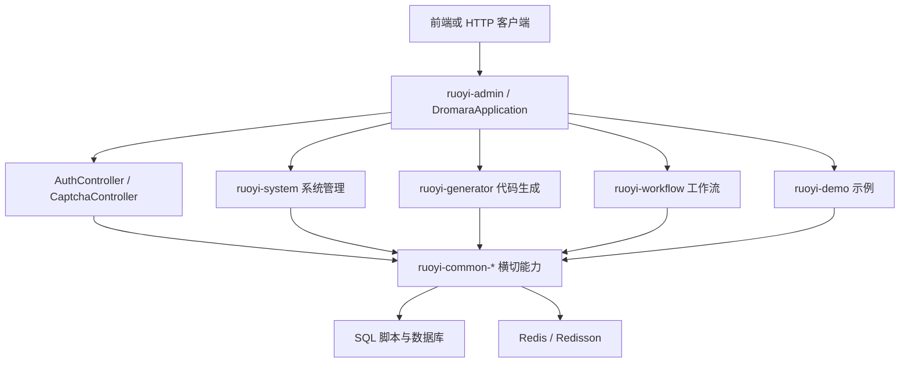

# 当前代码地图

## 目标

本文档是 HarnessBase 的事实锚点，用于防止文档继续偏离当前代码。凡是架构、设计、评审或发布文档与本文冲突，应先回到真实代码核对。

## 顶层结构

```text
.
├── AGENTS.md
├── README.md
├── docs/
├── server/
├── web/
├── deploy/
└── .github/workflows/
```

| 路径 | 当前事实 | 维护要求 |
| --- | --- | --- |
| [server](../../server) | RuoYi-Vue-Plus 后端 Maven 多模块工程 | 后端开发、构建、SQL 脚本以此为准 |
| [web](../../web) | RuoYi-Vue-Plus Vue 3 前端应用 | 前端页面、接口客户端、路由与状态以此为准 |
| [docs](../../docs) | 仓库级协作文档、架构、规范、计划、评审材料 | 必须匹配当前代码事实 |
| [deploy](../../deploy) | 发布、回滚、本地观测支撑材料 | 发布脚本和 workflow 必须匹配真实源码入口 |
| [.github/workflows](../../.github/workflows) | CI、发布、回滚和远端初始化工作流 | 必须指向 `server/`、`web/` 和 `deploy/` 当前路径 |

## 后端地图

后端根：[server/pom.xml](../../server/pom.xml)

已确认事实：

- `artifactId` 为 `ruoyi-vue-plus`，版本属性 `revision` 为 `5.6.1`。
- `spring-boot.version` 为 `3.5.14`。
- `java.version` 为 `17`。
- Maven 顶层模块为 `ruoyi-admin`、`ruoyi-common`、`ruoyi-extend`、`ruoyi-modules`。

```text
server/
├── ruoyi-admin/
├── ruoyi-common/
├── ruoyi-modules/
├── ruoyi-extend/
└── script/
```

| 模块 | 主要职责 |
| --- | --- |
| [server/ruoyi-admin](../../server/ruoyi-admin) | Spring Boot 启动入口、认证入口、应用配置、最终打包 Jar |
| [server/ruoyi-common](../../server/ruoyi-common) | 公共基础能力，包含 core、web、mybatis、redis、satoken、tenant、oss、log、excel、sse、websocket 等 |
| [server/ruoyi-modules/ruoyi-system](../../server/ruoyi-modules/ruoyi-system) | 系统管理主业务，包含用户、角色、部门、菜单、字典、租户、客户端、OSS、通知、日志等 |
| [server/ruoyi-modules/ruoyi-generator](../../server/ruoyi-modules/ruoyi-generator) | 代码生成器 |
| [server/ruoyi-modules/ruoyi-job](../../server/ruoyi-modules/ruoyi-job) | 定时任务客户端能力 |
| [server/ruoyi-modules/ruoyi-workflow](../../server/ruoyi-modules/ruoyi-workflow) | 工作流定义、实例、任务、分类、表达式与请假示例 |
| [server/ruoyi-modules/ruoyi-demo](../../server/ruoyi-modules/ruoyi-demo) | 框架能力示例 |
| [server/ruoyi-extend](../../server/ruoyi-extend) | Spring Boot Admin 与 SnailJob Server 等独立扩展 |
| [server/script](../../server/script) | SQL、Docker Compose、启动脚本和示例流程数据 |

## 后端入口与关键链路



关键事实：

- 启动类为 [server/ruoyi-admin/src/main/java/org/dromara/DromaraApplication.java](../../server/ruoyi-admin/src/main/java/org/dromara/DromaraApplication.java)。
- 认证入口为 [server/ruoyi-admin/src/main/java/org/dromara/web/controller/AuthController.java](../../server/ruoyi-admin/src/main/java/org/dromara/web/controller/AuthController.java)。
- 统一响应对象为 [server/ruoyi-common/ruoyi-common-core/src/main/java/org/dromara/common/core/domain/R.java](../../server/ruoyi-common/ruoyi-common-core/src/main/java/org/dromara/common/core/domain/R.java)。
- 全局异常处理为 [server/ruoyi-common/ruoyi-common-web/src/main/java/org/dromara/common/web/handler/GlobalExceptionHandler.java](../../server/ruoyi-common/ruoyi-common-web/src/main/java/org/dromara/common/web/handler/GlobalExceptionHandler.java)。
- i18n 消息读取为 [server/ruoyi-common/ruoyi-common-core/src/main/java/org/dromara/common/core/utils/MessageUtils.java](../../server/ruoyi-common/ruoyi-common-core/src/main/java/org/dromara/common/core/utils/MessageUtils.java)。

## 前端地图

前端根：[web/package.json](../../web/package.json)

已确认事实：

- 包名为 `ruoyi-vue-plus`。
- 使用 Vue 3、TypeScript、Vite、Element Plus、Pinia、Vue Router、VXE Table。
- 依赖解析由 [web/pnpm-lock.yaml](../../web/pnpm-lock.yaml) 和 [web/package.json](../../web/package.json) 中的 `packageManager` 字段固定。

```text
web/
├── src/api/
├── src/views/
├── src/router/
├── src/store/
├── src/layout/
├── src/components/
├── src/utils/
└── vite/
```

| 路径 | 主要职责 |
| --- | --- |
| [web/src/api](../../web/src/api) | 前端接口客户端，按 system、monitor、tool、workflow、demo 等能力分组 |
| [web/src/views/system](../../web/src/views/system) | 用户、角色、部门、菜单、租户、客户端、字典、配置、OSS、通知等系统管理页面 |
| [web/src/views/monitor](../../web/src/views/monitor) | 在线用户、登录日志、操作日志、缓存、Admin、SnailJob 等监控页面 |
| [web/src/views/tool/gen](../../web/src/views/tool/gen) | 代码生成器页面 |
| [web/src/views/workflow](../../web/src/views/workflow) | 工作流定义、实例、任务、分类、请假示例等页面 |
| [web/src/store](../../web/src/store) | Pinia 状态模块 |
| [web/src/router](../../web/src/router) | 路由配置 |

## 数据脚本与迁移事实

当前数据库事实入口是 [server/script/sql](../../server/script/sql)，包括：

- `ry_vue_5.X.sql`
- `ry_job.sql`
- `ry_workflow.sql`
- `update/` 版本升级脚本
- `oracle/`、`postgres/`、`sqlserver/` 兼容脚本

当前仓库没有 Flyway 目录或 Flyway Maven 依赖。后续如果引入 Flyway，必须作为单独迁移任务处理，并同步修改 [docs/architecture/target-technology-baseline.md](target-technology-baseline.md)、[docs/architecture/data-flow.md](data-flow.md) 和 [deploy/release/README.md](../../deploy/release/README.md)。

## 已知历史语境

- 旧源码路径已经不是当前源码入口，后续 workflow 和文档不能重新引用为事实。
- [.github/workflows](../../.github/workflows) 当前应使用 `server/`、`web/`、`deploy/` 作为真实入口。
- [.github/README.md](../../.github/README.md) 是当前 workflow 的目录入口，供发布、回滚、初始化和 CI 校验时快速导航。
- [deploy/release](../../deploy/release) 中 systemd 模板仍使用 `harness-base` 作为部署服务名语境，修改服务名时必须同步 workflow、脚本和发布文档。
- [server/README.md](../../server/README.md) 和 [web/README.md](../../web/README.md) 已收敛为当前仓库的本地目录入口；上游 RuoYi-Vue-Plus / plus-ui 资料仅作为外部参考，不再作为本仓库协作入口。

## 维护规则

- 任何架构文档更新前，先核对本文与真实代码。
- 新增或删除后端模块、前端目录、发布入口、workflow 时，同步更新本文。
- 如果发现旧文档声称与本文冲突，优先修旧文档，不要复制旧说法。
