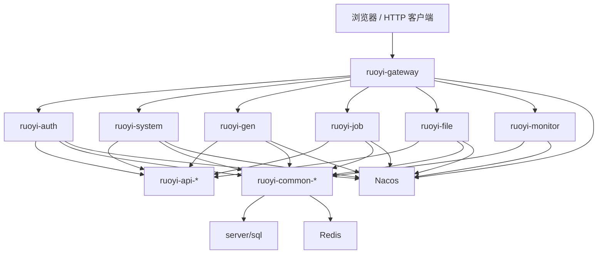

# 当前代码地图

## 目标

本文档是 HarnessBase 的事实锚点，用于回答三个问题：

1. 代码主入口在哪里。
2. 关键模块分别负责什么。
3. 我应该从哪个真实目录开始阅读或改动。

凡是架构、设计、评审或发布文档与本文冲突，应优先回到真实代码核对。

## 顶层结构

```text
.
├── AGENTS.md
├── README.md
├── docs/
├── server/
├── web/
├── deploy/
└── .github/workflows/
```

| 路径 | 当前事实 | 维护要求 |
| --- | --- | --- |
| [server](../../server) | 若依微服务后端 Maven 多模块工程 | 后端开发、构建、服务拆分、SQL 脚本以此为准 |
| [web](../../web) | Vue 2 + Vue CLI 的管理后台前端应用 | 前端页面、接口客户端、路由与状态以此为准 |
| [docs](../../docs) | 仓库级协作文档、架构、规范、计划、评审材料 | 必须匹配当前代码事实 |
| [deploy](../../deploy) | 发布、回滚、本地观测支撑材料 | 发布脚本和 workflow 必须匹配真实服务入口 |
| [.github/workflows](../../.github/workflows) | CI、发布、回滚和远端初始化工作流 | 必须指向 `server/`、`web/` 和 `deploy/` 当前路径 |

## 读代码起点

| 你要看的内容 | 建议起点 |
| --- | --- |
| 仓库整体入口 | [README.md](../../README.md) |
| 仓库协作与硬规则 | [AGENTS.md](../../AGENTS.md) |
| 后端服务结构 | [server/README.md](../../server/README.md) |
| 前端结构 | [web/README.md](../../web/README.md) |
| 发布与 workflow | [.github/README.md](../../.github/README.md)、[deploy/release/README.md](../../deploy/release/README.md) |

## 后端地图

后端根：[server/pom.xml](../../server/pom.xml)

已确认事实：

- `groupId` 为 `com.ruoyi`
- `artifactId` 为 `ruoyi`
- `version` 为 `3.6.8`
- `java.version` 为 `17`
- `spring-boot.version` 为 `4.0.3`
- Maven 顶层模块为 `ruoyi-auth`、`ruoyi-gateway`、`ruoyi-visual`、`ruoyi-modules`、`ruoyi-api`、`ruoyi-common`

```text
server/
├── ruoyi-auth/
├── ruoyi-gateway/
├── ruoyi-visual/
├── ruoyi-modules/
├── ruoyi-api/
├── ruoyi-common/
├── sql/
├── docker/
└── bin/
```

| 模块 | 主要职责 |
| --- | --- |
| [server/ruoyi-gateway](../../server/ruoyi-gateway) | 网关入口、统一路由、过滤器、验证码链路、网关异常处理 |
| [server/ruoyi-auth](../../server/ruoyi-auth) | 认证中心、登录授权、密码校验、登录日志写入 |
| [server/ruoyi-api](../../server/ruoyi-api) | 服务间远程接口定义与共享模型 |
| [server/ruoyi-common](../../server/ruoyi-common) | 公共基础能力，例如 core、redis、security、datasource、swagger、log 等 |
| [server/ruoyi-modules/ruoyi-system](../../server/ruoyi-modules/ruoyi-system) | 系统管理主业务，包含用户、角色、部门、菜单、字典、租户、参数、日志等 |
| [server/ruoyi-modules/ruoyi-gen](../../server/ruoyi-modules/ruoyi-gen) | 代码生成服务 |
| [server/ruoyi-modules/ruoyi-job](../../server/ruoyi-modules/ruoyi-job) | 定时任务服务 |
| [server/ruoyi-modules/ruoyi-file](../../server/ruoyi-modules/ruoyi-file) | 文件服务 |
| [server/ruoyi-visual/ruoyi-monitor](../../server/ruoyi-visual/ruoyi-monitor) | 可视化监控服务 |
| [server/sql](../../server/sql) | 当前仓库维护的数据库脚本 |
| [server/docker](../../server/docker) | 后端相关 Docker 配置 |
| [server/bin](../../server/bin) | 后端启动辅助脚本 |

## 后端入口与关键链路



关键入口：

- 网关启动类：[RuoYiGatewayApplication.java](../../server/ruoyi-gateway/src/main/java/com/ruoyi/gateway/RuoYiGatewayApplication.java)
- 认证启动类：[RuoYiAuthApplication.java](../../server/ruoyi-auth/src/main/java/com/ruoyi/auth/RuoYiAuthApplication.java)
- 系统服务启动类：[RuoYiSystemApplication.java](../../server/ruoyi-modules/ruoyi-system/src/main/java/com/ruoyi/system/RuoYiSystemApplication.java)
- 代码生成启动类：[RuoYiGenApplication.java](../../server/ruoyi-modules/ruoyi-gen/src/main/java/com/ruoyi/gen/RuoYiGenApplication.java)
- 任务服务启动类：[RuoYiJobApplication.java](../../server/ruoyi-modules/ruoyi-job/src/main/java/com/ruoyi/job/RuoYiJobApplication.java)
- 文件服务启动类：[RuoYiFileApplication.java](../../server/ruoyi-modules/ruoyi-file/src/main/java/com/ruoyi/file/RuoYiFileApplication.java)
- 监控服务启动类：[RuoYiMonitorApplication.java](../../server/ruoyi-visual/ruoyi-monitor/src/main/java/com/ruoyi/modules/monitor/RuoYiMonitorApplication.java)

如果你是在做功能开发，通常可以按下面路径进入：

- 权限、菜单、用户、角色、部门、租户、日志：从 [server/ruoyi-modules/ruoyi-system](../../server/ruoyi-modules/ruoyi-system) 开始
- 登录、Token、验证码、认证链路：从 [server/ruoyi-auth](../../server/ruoyi-auth) 开始
- 路由转发、网关过滤、统一入口：从 [server/ruoyi-gateway](../../server/ruoyi-gateway) 开始
- 定时任务：从 [server/ruoyi-modules/ruoyi-job](../../server/ruoyi-modules/ruoyi-job) 开始
- 文件上传下载：从 [server/ruoyi-modules/ruoyi-file](../../server/ruoyi-modules/ruoyi-file) 开始
- 代码生成：从 [server/ruoyi-modules/ruoyi-gen](../../server/ruoyi-modules/ruoyi-gen) 开始

## 前端地图

前端根：[web/package.json](../../web/package.json)

已确认事实：

- 包名为 `ruoyi`
- 版本为 `3.6.8`
- 使用 Vue 2、Vue CLI、Element UI、Vuex、Vue Router 3
- 当前前端主语言为 JavaScript，不是 TypeScript

```text
web/
├── src/api/
├── src/views/
├── src/router/
├── src/store/
├── src/layout/
├── src/components/
├── src/utils/
└── main.js
```

| 路径 | 主要职责 |
| --- | --- |
| [web/src/api](../../web/src/api) | 前端接口客户端，按 `system`、`monitor`、`tool` 等功能域组织 |
| [web/src/views/system](../../web/src/views/system) | 用户、角色、部门、菜单、字典、参数、租户等系统管理页面 |
| [web/src/views/monitor](../../web/src/views/monitor) | 在线用户、登录日志、操作日志、服务监控、缓存、任务日志等页面 |
| [web/src/views/tool](../../web/src/views/tool) | 代码生成等工具页 |
| [web/src/store](../../web/src/store) | Vuex 状态管理 |
| [web/src/router](../../web/src/router) | Vue Router 3 路由配置 |
| [web/src/layout](../../web/src/layout) | 全局布局 |
| [web/src/components](../../web/src/components) | 通用组件 |

关键入口：

- 前端应用入口：[web/src/main.js](../../web/src/main.js)
- 路由入口：[web/src/router/index.js](../../web/src/router/index.js)
- 状态入口：[web/src/store/index.js](../../web/src/store/index.js)

如果你是在做页面开发，通常可以按下面路径进入：

- 系统管理页面：从 [web/src/views/system](../../web/src/views/system) 开始
- 监控页面：从 [web/src/views/monitor](../../web/src/views/monitor) 开始
- 工具页面：从 [web/src/views/tool](../../web/src/views/tool) 开始
- 接口请求封装：从 [web/src/api](../../web/src/api) 开始
- 权限路由与导航：从 [web/src/router](../../web/src/router) 和 [web/src/store](../../web/src/store) 开始

## 数据脚本事实

当前数据库事实入口是 [server/sql](../../server/sql)，已存在脚本包括：

- [quartz.sql](../../server/sql/quartz.sql)
- [ry_20260321.sql](../../server/sql/ry_20260321.sql)
- [ry_config_20260311.sql](../../server/sql/ry_config_20260311.sql)
- [ry_seata_20210128.sql](../../server/sql/ry_seata_20210128.sql)

当前仓库未见 Flyway 目录或迁移脚本体系。后续如果引入新的迁移机制，必须作为单独架构变更处理，并同步修改 [docs/architecture/target-technology-baseline.md](target-technology-baseline.md)、[docs/architecture/data-flow.md](data-flow.md) 和 [deploy/release/README.md](../../deploy/release/README.md)。

## 命名与入口约定

- 后端服务入口以 `ruoyi-*` 模块路径为准。
- 数据库脚本入口以 [server/sql](../../server/sql) 为准。
- 前端工程入口以 [web/src](../../web/src) 为准。
- 仓库级导航以 [README.md](../../README.md)、[AGENTS.md](../../AGENTS.md)、[docs/README.md](../README.md) 为准。

## 维护规则

- 任何架构文档更新前，先核对本文与真实代码。
- 新增或删除后端服务、前端目录、发布入口、workflow 时，同步更新本文。
- 如果发现其他文档中的路径、模块名或入口与本文不一致，优先修正文档入口，不在冲突状态下继续扩写。
