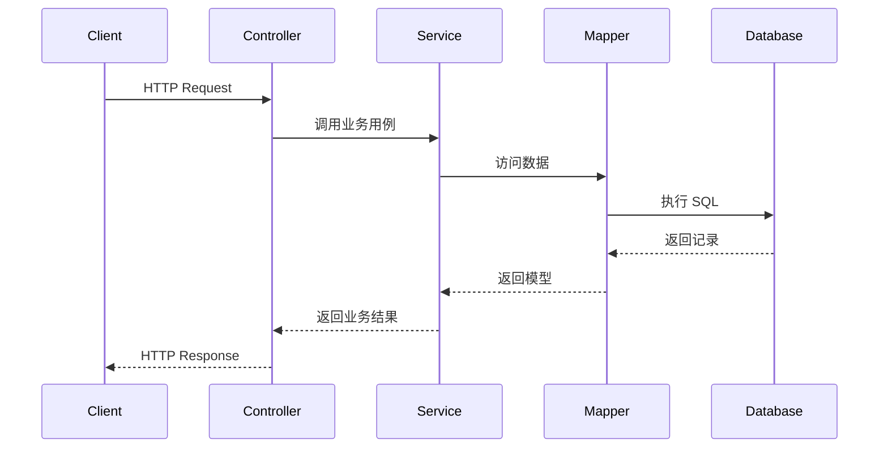

# 数据流说明

## 当前状态

当前仓库已经具备 CallCenter 前后台工程底座，但呼叫中心核心业务模块仍在逐步落地。本文档描述后续新增业务模块时必须遵守的目标数据流，用于约束前端、Controller、Service、Mapper、领域模型、adapter 和外部系统之间的职责边界。

## HTTP 请求主流程

典型 HTTP 请求按以下路径流转：

```text
Client
  -> Controller
  -> Service / Application Use Case
  -> Mapper / Repository
  -> Database
  -> Service
  -> Controller
  -> Client
```

职责边界：

- Controller 负责协议适配、参数校验和响应映射。
- Service / Application Use Case 负责业务规则、事务和用例编排。
- Mapper / Repository 负责数据访问。
- Domain 承载电话、坐席、通话、CTI、录音、质检、AI、报表等领域模型。



## CTI 事件数据流

CTI 或电话系统事件必须先进入 adapter，再转换为系统内部标准事件：

```text
Huawei CTI / Phone System
  -> CTI Adapter
  -> Internal Call Event
  -> Call Service
  -> Agent Status / Call Record
  -> Realtime Push
```

必须满足：

- 外部事件格式不得直接扩散到业务模块。
- 事件处理必须幂等。
- 事件时间、接收时间和处理时间应可追踪。
- 接听、挂断、转接、外呼等控制动作必须通过统一接口暴露。

## 实时推送数据流

坐席状态、来电弹屏、话务条和聊天消息属于实时链路：

```text
Business Event
  -> Realtime Service
  -> WebSocket / SSE
  -> Agent Workspace
```

实时链路必须明确：

- 连接状态。
- 断线重连策略。
- 多实例广播策略。
- 消息重复、乱序和延迟处理。
- 推送失败后的降级路径。

## 写入数据流

写入类请求应遵循：

1. Controller 接收请求对象并做基础校验。
2. Service 校验业务规则并开启事务。
3. Mapper / Repository 执行数据库写入。
4. Service 生成业务结果或领域事件。
5. Controller 将结果映射为统一响应。

数据库结构变更必须通过受控脚本或迁移流程管理，不能只修改实体或 SQL 片段。

## 查询数据流

查询类请求应遵循：

1. Controller 接收分页、过滤和排序参数。
2. Service 进行权限、数据范围和业务条件约束。
3. Mapper / Repository 生成数据库查询。
4. Service 将持久化模型转换为业务响应。

禁止在 Controller 中直接拼接查询条件或绕过 Service 调用 Mapper。

## 外部系统数据流

CRM、工单、客户资料系统、AI 转写服务和对象存储都必须通过 adapter 或 integration 边界接入：

```text
Service -> Adapter / Integration -> External System
```

禁止在 Controller 或核心业务模块中直接拼装第三方协议、URL、认证头或 SDK 调用细节。

## 错误数据流

异常应统一映射为错误响应：

```text
Business Exception
  -> Global Exception Handler
  -> Error Code
  -> HTTP Response
```

错误码登记在 [docs/reference/error-codes.md](../reference/error-codes.md)。新增错误码时必须同步文档。

## 日志与审计数据流

日志使用项目既有日志体系。审计、telemetry、外部调用追踪等能力应通过可注入组件接入。

日志中不得输出密码、令牌、身份证号、银行卡号、完整手机号、完整录音地址或完整密钥。需要定位问题时使用请求 ID、用户 ID、坐席 ID、通话 ID、事件 ID 等可控字段。
