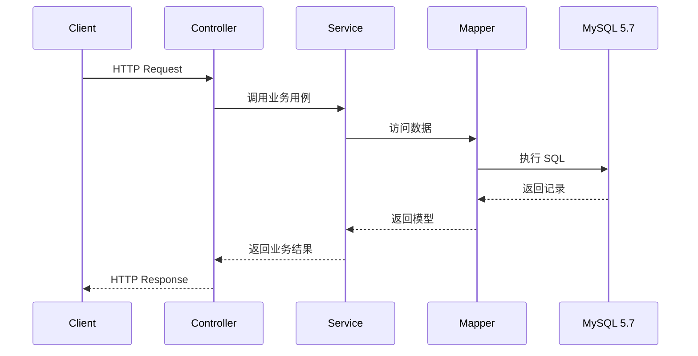

# 数据流说明

## 当前状态

当前仓库尚未实现具体业务接口。本文档描述后续新增业务模块时必须遵守的目标数据流，用于约束 Controller、Service、Mapper、Domain、Infrastructure 和 MySQL 之间的职责边界。

## 请求处理主流程

典型 HTTP 请求按以下路径流转：

```text
Client
  -> Controller
  -> Service
  -> Mapper
  -> MySQL 5.7
  -> Mapper
  -> Service
  -> Controller
  -> Client
```

职责边界：

- Controller 负责协议适配、参数校验和响应映射。
- Service 负责业务规则、事务和用例编排。
- Mapper 负责数据访问。
- Domain 承载领域模型、枚举和值对象。



## 写入数据流

写入类请求应遵循：

1. Controller 接收请求对象并做基础校验。
2. Service 校验业务规则并开启事务。
3. Mapper 执行数据库写入。
4. Service 生成业务结果。
5. Controller 将结果映射为统一响应。

数据库结构变更必须先由 Flyway migration 定义，再由业务代码使用。

## 查询数据流

查询类请求应遵循：

1. Controller 接收分页、过滤和排序参数。
2. Service 进行权限、租户和业务条件约束。
3. Mapper 生成 MySQL 5.7 兼容查询。
4. Service 将持久化模型转换为业务响应。

禁止在 Controller 中直接拼接查询条件或绕过 Service 调用 Mapper。

## 认证数据流

认证与授权能力属于横切关注点，应通过 Spring 注入进入业务流程。

```text
Request
  -> Auth Filter 或 Interceptor
  -> Security Context
  -> Controller
  -> Service 权限校验
```

Controller 不应自行解析复杂认证逻辑。Service 在执行业务用例时必须基于当前用户、组织或角色做权限校验。

当前认证模块尚未实现，设计边界见 [docs/design/feature-auth.md](../design/feature-auth.md)。

## 外部 API 数据流

外部 API 调用统一通过 `ApiClient` 抽象：

```text
Service -> ApiClient -> External System
```

禁止在 Service 或 Controller 中裸用 `RestTemplate`、`HttpURLConnection` 或自行创建 HTTP 客户端。

`ApiClient` 应放在 `infrastructure`，由 `config` 装配为 Spring Bean，再由 `service` 通过构造器注入使用。

## 错误数据流

异常应统一映射为错误响应：

```text
Business Exception
  -> Global Exception Handler
  -> Error Code
  -> HTTP Response
```

错误码登记在 `docs/reference/error-codes.md`。新增错误码时必须同步文档。

## 日志与审计数据流

日志使用 SLF4J `Logger`。审计、telemetry 等能力通过 Spring Bean 注入。

日志中不得输出密码、令牌、身份证号、银行卡号或完整密钥。需要定位问题时使用请求 ID、用户 ID、项目 ID 等可控字段。
