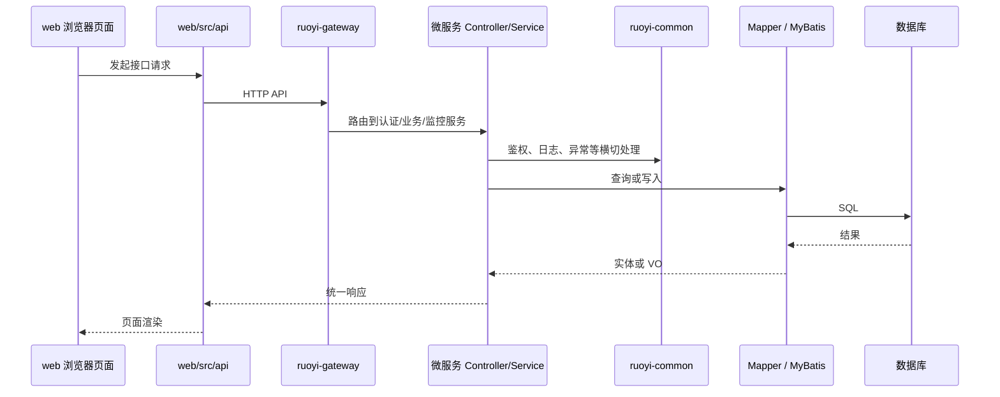

# 数据流说明

## HTTP 请求主流程



## 认证与会话流

认证入口主要位于 [server/ruoyi-auth/src/main/java/com/ruoyi/auth/controller/TokenController.java](../../server/ruoyi-auth/src/main/java/com/ruoyi/auth/controller/TokenController.java)。

验证码与网关侧校验主要位于 [server/ruoyi-gateway](../../server/ruoyi-gateway) 的过滤器与校验逻辑中。

## 系统管理流

系统管理能力主要位于 [server/ruoyi-modules/ruoyi-system](../../server/ruoyi-modules/ruoyi-system)，前端对应 [web/src/views/system](../../web/src/views/system) 和 [web/src/api/system](../../web/src/api/system)。

典型路径：

```text
web/src/views/system/user
  -> web/src/api/system/user
  -> gateway 路由
  -> ruoyi-system / SysUserController
  -> ISysUserService
  -> SysUserMapper
  -> 数据库
```

## 工具流

代码生成与表单构建页面位于 [web/src/views/tool](../../web/src/views/tool)，其中后端生成器服务主要对应 [server/ruoyi-modules/ruoyi-gen](../../server/ruoyi-modules/ruoyi-gen)，前端 API 入口为 [web/src/api/tool/gen.js](../../web/src/api/tool/gen.js)。

## 响应与异常流

统一响应与异常处理以当前公共能力模块为准。涉及新增错误语义时，同步检查 [docs/reference/error-codes.md](../reference/error-codes.md)。

## 数据脚本流

当前数据库结构不由 Flyway 管理，而是由 [server/sql](../../server/sql) 维护。结构变更必须同步相关 SQL 脚本，并在发布前核对环境执行路径。

## 外部依赖流

现有外部依赖通过公共模块接入，例如 Redis、日志、安全、数据源、Swagger 等。新增外部依赖时，应优先复用或扩展对应 common 模块。
