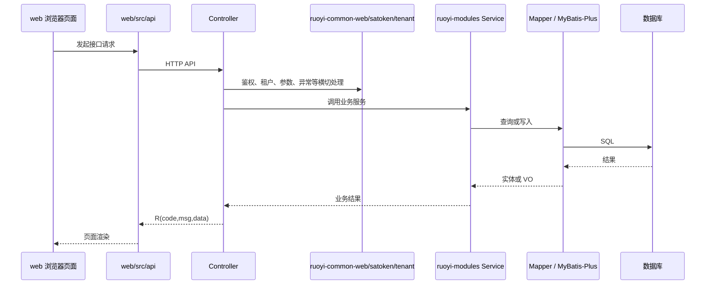

# 数据流说明

## HTTP 请求主流程



## 认证与会话流

认证入口主要位于 [server/ruoyi-admin/src/main/java/org/dromara/web/controller/AuthController.java](../../server/ruoyi-admin/src/main/java/org/dromara/web/controller/AuthController.java)：

- `/auth/login`：登录，校验 `clientId`、`grantType`、租户状态，并按授权类型进入 `IAuthStrategy`。
- `/auth/logout`：登出。
- `/auth/register`：注册。
- `/auth/tenant/list`：登录页租户列表。
- `/auth/social/callback`、`/auth/binding/{source}`：第三方授权绑定。

验证码入口主要位于 [server/ruoyi-admin/src/main/java/org/dromara/web/controller/CaptchaController.java](../../server/ruoyi-admin/src/main/java/org/dromara/web/controller/CaptchaController.java)。

## 系统管理流

系统管理能力主要位于 [server/ruoyi-modules/ruoyi-system](../../server/ruoyi-modules/ruoyi-system)，前端对应 [web/src/views/system](../../web/src/views/system) 与 [web/src/api/system](../../web/src/api/system)。

典型路径：

```text
web/src/views/system/user
  -> web/src/api/system/user
  -> /system/user
  -> SysUserController
  -> ISysUserService
  -> SysUserMapper
  -> sys_user 等系统表
```

## 工作流流

工作流能力主要位于 [server/ruoyi-modules/ruoyi-workflow](../../server/ruoyi-modules/ruoyi-workflow)，前端对应 [web/src/views/workflow](../../web/src/views/workflow) 与 [web/src/api/workflow](../../web/src/api/workflow)。

典型接口分组：

- `/workflow/definition`
- `/workflow/category`
- `/workflow/instance`
- `/workflow/task`
- `/workflow/leave`

## 代码生成流

代码生成能力主要位于 [server/ruoyi-modules/ruoyi-generator](../../server/ruoyi-modules/ruoyi-generator)，前端对应 [web/src/views/tool/gen](../../web/src/views/tool/gen) 与 [web/src/api/tool/gen](../../web/src/api/tool/gen)。

典型接口分组：

- `/tool/gen/list`
- `/tool/gen/db/list`
- `/tool/gen/importTable`
- `/tool/gen/preview/{tableId}`
- `/tool/gen/download/{tableId}`
- `/tool/gen/genCode/{tableId}`

## 响应与异常流

统一响应对象是 [server/ruoyi-common/ruoyi-common-core/src/main/java/org/dromara/common/core/domain/R.java](../../server/ruoyi-common/ruoyi-common-core/src/main/java/org/dromara/common/core/domain/R.java)：

- 成功默认 `code=200`。
- 失败默认 `code=500`。
- 警告使用 `code=601`。
- `data` 承载响应数据，`msg` 承载提示消息。

全局异常处理位于 [server/ruoyi-common/ruoyi-common-web/src/main/java/org/dromara/common/web/handler/GlobalExceptionHandler.java](../../server/ruoyi-common/ruoyi-common-web/src/main/java/org/dromara/common/web/handler/GlobalExceptionHandler.java)。新增异常类型时，应同步评估 [docs/reference/error-codes.md](../reference/error-codes.md) 是否需要补充。

## 数据脚本流

当前数据库结构不是 Flyway 管理，而是由 SQL 脚本维护：

```text
server/script/sql/
├── ry_vue_5.X.sql
├── ry_job.sql
├── ry_workflow.sql
├── update/
├── oracle/
├── postgres/
└── sqlserver/
```

结构变更必须同步初始化脚本与升级脚本。发布前应确认目标环境使用的数据库类型和脚本版本。

SQL 变更模板和验证清单见 [docs/reference/sql-change-checklist.md](../reference/sql-change-checklist.md)。

## 外部依赖流

现有外部依赖通过公共模块接入：

- Redis/Redisson：[server/ruoyi-common/ruoyi-common-redis](../../server/ruoyi-common/ruoyi-common-redis)
- 对象存储：[server/ruoyi-common/ruoyi-common-oss](../../server/ruoyi-common/ruoyi-common-oss)
- 短信：[server/ruoyi-common/ruoyi-common-sms](../../server/ruoyi-common/ruoyi-common-sms)
- 邮件：[server/ruoyi-common/ruoyi-common-mail](../../server/ruoyi-common/ruoyi-common-mail)
- 社交登录：[server/ruoyi-common/ruoyi-common-social](../../server/ruoyi-common/ruoyi-common-social)
- SSE/WebSocket：[server/ruoyi-common/ruoyi-common-sse](../../server/ruoyi-common/ruoyi-common-sse)、[server/ruoyi-common/ruoyi-common-websocket](../../server/ruoyi-common/ruoyi-common-websocket)

新增外部依赖时，应优先复用或扩展对应 common 模块。
