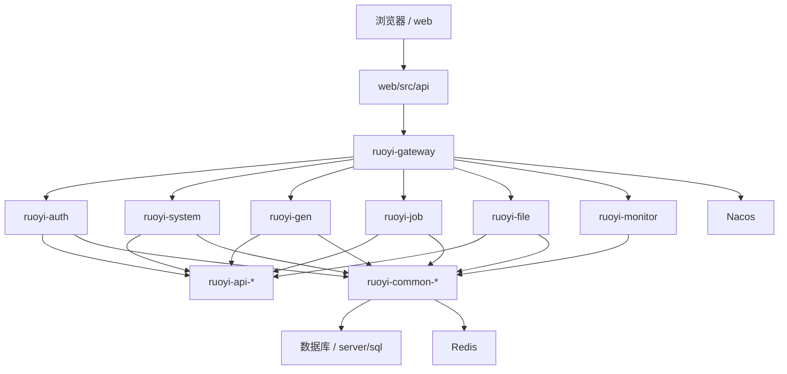

# 系统架构总览

## 项目定位

HarnessBase 是一个面向后台管理场景的微服务工程基座。它以若依微服务结构为基础，把认证、网关、系统管理、代码生成、定时任务、文件服务、监控以及前端管理后台组织在同一仓库内，并通过文档、评审、发布和自动化护栏维持一致性。

详细代码地图见 [docs/architecture/code-map.md](code-map.md)。

## 技术基线

当前后端基线由 [server/pom.xml](../../server/pom.xml) 确认：

- JDK 17
- Spring Boot 4.0.3
- Spring Cloud 2025.1.0
- Spring Cloud Alibaba 2025.1.0.0
- Maven 多模块工程
- MyBatis、PageHelper、dynamic-datasource、Druid
- OpenFeign、Gateway、Nacos
- Redis
- SpringDoc

当前前端基线由 [web/package.json](../../web/package.json) 确认：

- Vue 2
- JavaScript
- Vue CLI
- Element UI
- Vuex
- Vue Router 3

更完整的版本与依赖说明见 [docs/architecture/target-technology-baseline.md](target-technology-baseline.md)。

## 后端结构

```text
server/
├── ruoyi-auth/
├── ruoyi-gateway/
├── ruoyi-visual/
├── ruoyi-modules/
├── ruoyi-api/
├── ruoyi-common/
├── sql/
├── docker/
└── bin/
```

模块职责：

- `ruoyi-gateway` 是统一网关入口，承载路由、过滤和网关层异常处理。
- `ruoyi-auth` 是认证中心，负责登录鉴权与认证链路。
- `ruoyi-common` 是公共能力层，包含 core、redis、security、swagger、log、datasource 等基础能力。
- `ruoyi-api` 是服务间远程接口层。
- `ruoyi-modules` 是业务服务层，包含 `system`、`gen`、`job`、`file`。
- `ruoyi-visual` 是可视化与监控服务层。
- `sql` 保存当前仓库维护的数据库脚本。

## 前端结构

```text
web/
├── src/api/
├── src/views/
├── src/router/
├── src/store/
├── src/layout/
├── src/components/
└── src/utils/
```

目录职责：

- `src/api` 按功能域维护前端请求封装。
- `src/views` 已包含 `system`、`monitor`、`tool` 等后台页面。
- `src/router` 和 `src/store` 分别管理路由与 Vuex 状态。
- `src/layout`、`src/components`、`src/utils` 承载共享布局、组件与工具能力。

## 模块导航

如果你需要快速跳到某个真实模块，优先使用下面的入口：

| 场景 | 入口 |
| --- | --- |
| 网关与统一入口 | [server/ruoyi-gateway](../../server/ruoyi-gateway) |
| 登录认证与鉴权 | [server/ruoyi-auth](../../server/ruoyi-auth) |
| 系统管理主业务 | [server/ruoyi-modules/ruoyi-system](../../server/ruoyi-modules/ruoyi-system) |
| 代码生成 | [server/ruoyi-modules/ruoyi-gen](../../server/ruoyi-modules/ruoyi-gen) |
| 定时任务 | [server/ruoyi-modules/ruoyi-job](../../server/ruoyi-modules/ruoyi-job) |
| 文件服务 | [server/ruoyi-modules/ruoyi-file](../../server/ruoyi-modules/ruoyi-file) |
| 监控服务 | [server/ruoyi-visual/ruoyi-monitor](../../server/ruoyi-visual/ruoyi-monitor) |
| 前端系统页 | [web/src/views/system](../../web/src/views/system) |
| 前端监控页 | [web/src/views/monitor](../../web/src/views/monitor) |
| 前端工具页 | [web/src/views/tool](../../web/src/views/tool) |

## 运行时链路



## 数据与迁移

当前仓库以 SQL 脚本维护数据库事实：

- 初始化/变更脚本位于 [server/sql](../../server/sql)
- 当前仓库未见 Flyway migration 体系

数据库结构变更时，必须同步：

- 更新对应 SQL 脚本
- 更新 [docs/reference/sql-change-checklist.md](../reference/sql-change-checklist.md)
- 评估发布与回滚影响，并同步 [deploy/release/README.md](../../deploy/release/README.md)

## 发布与观测

- 发布支撑材料位于 [deploy/release](../../deploy/release)
- 本地观测材料位于 [deploy/observability](../../deploy/observability)
- GitHub Actions 位于 [.github/workflows](../../.github/workflows)，当前主线围绕自动化护栏、后端构建、前端构建、模块级发布与服务级回滚展开

## 质量门禁

新增或修改代码时必须遵守：

- 新代码使用当前 Jakarta 体系，禁止新增旧 `javax.*`
- 使用构造器注入，禁止字段级 `@Autowired`
- 禁止新增 `System.out.println` 和 `e.printStackTrace()`
- 通过已有 common、api、gateway、auth 抽象接入横切能力
- 业务变更必须补测试；后端默认 JUnit 5，前端测试工具需按当前实际仓库能力补齐
- API、响应码、SQL 脚本、发布入口变化必须同步更新文档

## 相关入口

- [docs/architecture/code-map.md](code-map.md)
- [docs/architecture/target-technology-baseline.md](target-technology-baseline.md)
- [docs/architecture/boundaries.md](boundaries.md)
- [docs/architecture/data-flow.md](data-flow.md)
- [docs/architecture/harness-engineering-adaptation.md](harness-engineering-adaptation.md)
