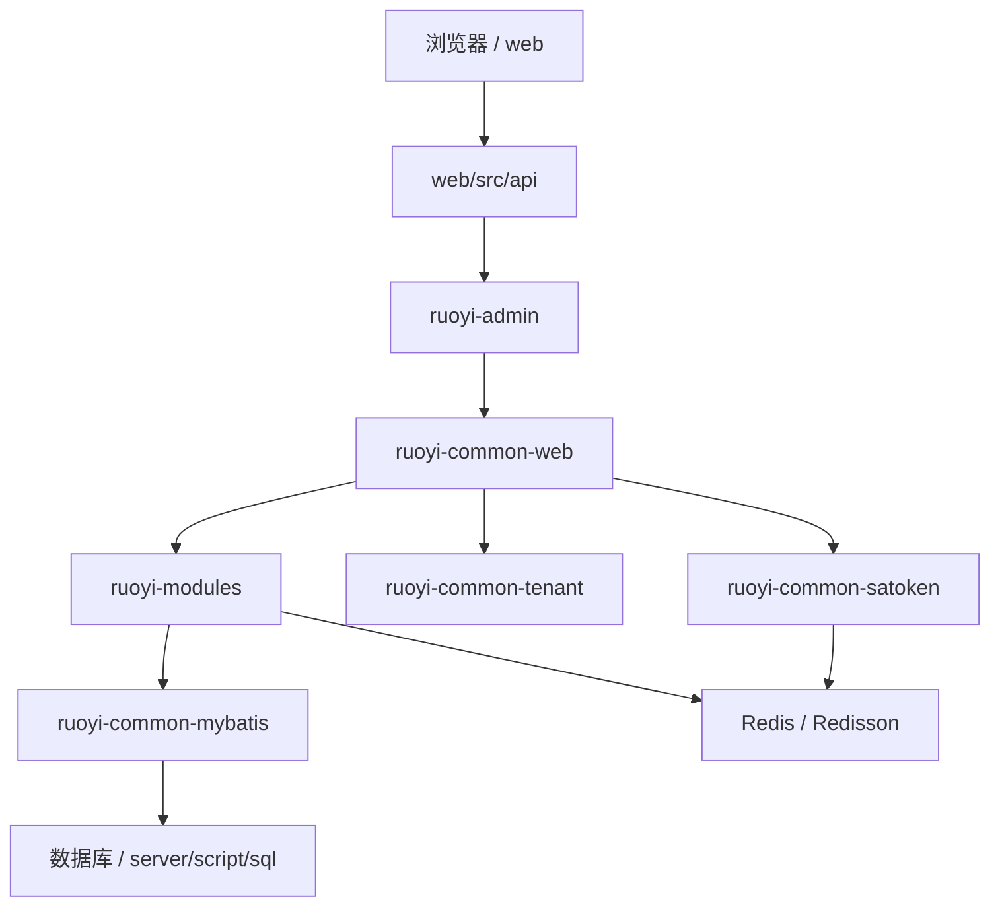

# 系统架构概览

## 项目定位

HernessDemo 当前是基于 `RuoYi-Vue-Plus 5.6.1` 的多租户后台管理系统重构工作区。当前建设重点不是从零实现项目管理 MVP，而是让现有 RuoYi-Vue-Plus 后台体系、文档、发布材料和 Harness Engineering 护栏对齐。

详细代码地图见 [docs/architecture/code-map.md](code-map.md)。

## 技术基线

当前后端基线由 [server/pom.xml](../../server/pom.xml) 确认：

- JDK 17。
- Spring Boot 3.5.x / Spring Framework 6。
- Maven 多模块工程。
- MyBatis-Plus Boot 3、dynamic-datasource、p6spy。
- Sa-Token、JWT、JustAuth。
- Redis、Redisson、Lock4j。
- SpringDoc、Actuator、Spring Boot Admin。

当前前端基线由 [web/package.json](../../web/package.json) 确认：

- Vue 3。
- TypeScript。
- Vite。
- Element Plus。
- Pinia。
- Vue Router。
- VXE Table。
- Vitest。

## 后端结构

```text
server/
├── ruoyi-admin/
├── ruoyi-common/
├── ruoyi-modules/
├── ruoyi-extend/
└── script/
```

职责说明：

- `ruoyi-admin` 是 Web 服务启动与打包入口，承载认证控制器、应用配置和最终 Jar。
- `ruoyi-common` 是公共能力层，包含 core、web、mybatis、redis、satoken、tenant、security、oss、log、excel、sse、websocket 等基础能力。
- `ruoyi-modules` 是主要业务与功能模块层，包含 system、generator、job、workflow、demo。
- `ruoyi-extend` 是独立扩展层，包含 monitor admin 和 SnailJob server。
- `script` 保存 SQL、Docker Compose、启动脚本和工作流示例数据。

## 前端结构

```text
web/
├── src/api/
├── src/views/
├── src/router/
├── src/store/
├── src/layout/
├── src/components/
├── src/utils/
└── vite/
```

职责说明：

- `src/api` 按功能域维护前端请求封装。
- `src/views` 已包含 system、monitor、tool/gen、workflow、demo 等页面。
- `src/router` 和 `src/store` 分别管理路由与 Pinia 状态。
- `vite` 与根配置文件维护 Vite 插件和构建配置。

## 运行时链路



## 数据与迁移

当前仓库以 SQL 脚本维护数据库事实：

- 初始化脚本位于 [server/script/sql](../../server/script/sql)。
- 版本升级脚本位于 [server/script/sql/update](../../server/script/sql/update)。
- Oracle、PostgreSQL、SQL Server 兼容脚本也在 [server/script/sql](../../server/script/sql) 下维护。

当前没有 Flyway migration 体系。数据库结构变更必须同步更新 SQL 脚本和相关文档；若引入 Flyway，必须作为单独架构变更完成验证。

## 发布与观测

- 发布支撑材料位于 [deploy/release](../../deploy/release)。
- 本地观测材料位于 [deploy/observability](../../deploy/observability)。
- 当前 `.github/workflows` 中仍有 `services/callcenter-server` 历史引用，不能直接视为可用 CI/CD 事实。

## 质量门禁

新增或修改代码时必须遵守：

- 新代码使用 `jakarta.*`，禁止新增 `javax.*`。
- 使用构造器注入，禁止字段级 `@Autowired`。
- 禁止新增 `System.out.println` 和 `e.printStackTrace()`。
- 通过已有 common 能力接入鉴权、租户、日志、缓存、SSE、WebSocket、对象存储等横切能力。
- 业务变更必须补测试；后端默认 JUnit 5，前端默认 Vitest。
- API、响应码、数据库脚本、发布入口变化必须同步更新文档。

## 相关入口

- [docs/architecture/code-map.md](code-map.md)
- [docs/architecture/target-technology-baseline.md](target-technology-baseline.md)
- [docs/architecture/boundaries.md](boundaries.md)
- [docs/architecture/data-flow.md](data-flow.md)
- [docs/architecture/harness-engineering-adaptation.md](harness-engineering-adaptation.md)
