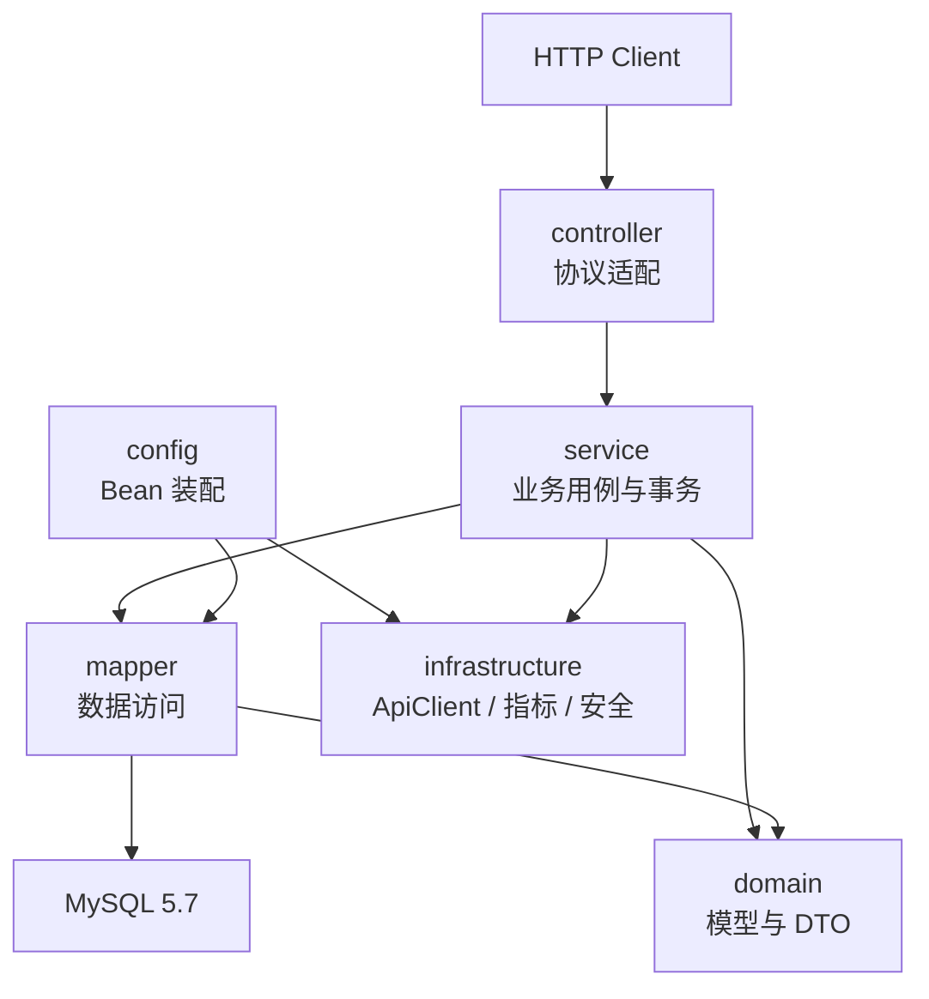

# 系统架构概览

## 项目定位

HernessDemo 是一个面向中小企业的在线项目管理平台，核心目标是支持项目、任务、成员、权限、搜索和计费等协作场景。

根目录 `server/` 的项目基线由根目录 `AGENTS.md` 定义：

- JDK 1.8
- Spring Boot 2.7.x
- Maven 3.6.3
- MySQL 5.7，字符集 `utf8mb4`
- MyBatis-Plus 3.5.x + Flyway
- JUnit 5

上述版本是兼容性边界，不允许在普通业务变更中擅自升级。

## 当前仓库状态

[事实] 当前仓库已经落地 HernessDemo 后端骨架、CallCenter 前后台 Service、文档体系、质量门禁、交付脚本和本地可观测性配置。HernessDemo 认证、搜索、计费等业务模块还没有对应 Controller、Service、Mapper 实现，当前以设计文档和 OpenAPI 基线作为目标契约。

当前主要入口：

- `server/pom.xml`: 后端 Maven 工程和质量门禁配置。
- `server/src/main/java/com/example/app/HernessDemoApplication.java`: Spring Boot 启动类。
- `server/src/main/resources/application*.yml`: 基础配置和环境 profile。
- `server/src/test/java/com/example/app/architecture/LayerDependencyTest.java`: 架构边界自动化检查。
- `services/callcenter-server`: CallCenter Java 17 后端 Service。
- `services/callcenter-web`: CallCenter Vue 3 前端 Service。
- `.github/workflows/`: CI、远端主机初始化、发布和回滚 workflow。
- `deploy/release/`: SSH/systemd 发布、回滚和远端主机初始化脚本。
- `deploy/observability/`: 本地可观测性配置。

## 顶层目录结构

```text
.
├── AGENTS.md
├── README.md
├── .github/workflows/
├── docs/
├── services/
├── server/
└── deploy/
```

- `docs/`: 架构、规范、设计、计划和参考文档。
- `docs/README.md`: 按任务组织的统一文档导航入口。
- `docs/delivery/`: 交付模型、环境、流水线、部署策略和制品治理文档。
- `docs/operations/`: 发布验证、配置密钥、运行手册和服务目标文档。
- `docs/governance/`: 发布审批、权限和审计治理文档。
- `docs/reviews/`: 需求、设计、代码和测试阶段的评审清单。
- `server/`: HernessDemo Java 8 + Spring Boot 2.7 后端服务。
- `services/`: 独立可交付 Service，目前包含 CallCenter 前后台。
- `deploy/`: 部署、环境、容器和运维材料。
- 根目录只保留项目入口文件、构建入口、仓库说明和必要配置。

当前仓库不使用根目录 `web/`。前端能力由 `services/callcenter-web` 作为独立 Service 承载。

## Service 架构

| Service | 路径 | 技术栈 | 当前定位 |
| --- | --- | --- | --- |
| `server` | `server/` | Java 8 + Spring Boot 2.7 + MyBatis-Plus + Flyway | HernessDemo 后端骨架 |
| `callcenter-server` | `services/callcenter-server/` | Java 17 + Spring Boot 3.5 + RuoYi-Vue-Plus 裁剪版 | CallCenter 后端 |
| `callcenter-web` | `services/callcenter-web/` | Vue 3 + TypeScript + Vite + Element Plus | CallCenter 前端 |

## HernessDemo 后端包结构

根 `server/` Spring Boot 工程标准包根路径为：

```text
server/src/main/java/com/example/app/
├── domain/
│   ├── model/
│   └── dto/
├── config/
├── mapper/
├── service/
├── controller/
└── infrastructure/
```

- `domain/model`: MyBatis-Plus Entity、Value Object 和领域枚举。
- `domain/dto`: Request、Response、Command、Query。Java 8 不支持 `record`，不可变 DTO 优先用 Lombok `@Value`。
- `config`: Spring 配置类、`@ConfigurationProperties`、`@MapperScan` 和 `MybatisPlusInterceptor`。
- `mapper`: MyBatis-Plus Mapper 接口，继承 `BaseMapper<T>`。
- `service`: 业务逻辑、事务边界和领域规则编排。
- `controller`: REST Controller、参数校验和 `@ControllerAdvice` 全局异常处理。
- `infrastructure`: ApiClient、日志、指标、安全、审计和外部系统适配器。

## HernessDemo 后端架构

后端按分层架构组织，业务依赖必须保持单向。主链路是：

```text
domain/config/mapper -> service -> controller
```

`infrastructure` 是横切基础设施层，用于 ApiClient、日志、指标、安全、审计和外部系统适配器。它只能作为 Spring Bean 被 `config` 装配、被 `service` 使用，禁止被 `controller` 绕过调用。

各层职责如下：

- `domain`: 领域模型、枚举、领域常量和值对象。
- `config`: Spring 配置、基础设施 Bean、属性绑定和横切能力装配。
- `mapper`: MyBatis-Plus Mapper、SQL 映射和持久化访问。
- `service`: 业务用例、事务边界、领域规则编排。
- `controller`: HTTP 入参出参、状态码映射、接口协议适配。
- `infrastructure`: 可注入的横切基础设施，不承载业务用例。

更细的依赖规则见 [docs/architecture/boundaries.md](boundaries.md)。



## 数据与迁移

数据库使用 MySQL 5.7，所有结构变更必须通过 Flyway migration 管理。业务代码、实体和 SQL 片段不能替代数据库迁移脚本。

迁移脚本应满足：

- 可以在空库上顺序执行。
- 可以在测试环境重复验证。
- 不使用 MySQL 8.x 独有语法。
- 涉及兼容性风险时，在文档中说明回滚方案或补偿方案。

## 外部交互

外部系统调用必须通过 `ApiClient` 抽象接入，禁止在业务代码中裸用 `RestTemplate` 或 `HttpURLConnection`。

所有横切关注点，例如认证、日志、审计和 telemetry，必须通过 Spring 注入，不允许用 `new` 手动实例化。

## 质量门禁

根 `server/` 新增业务代码必须满足：

- 标准验证命令为 `cd server && mvn -B clean verify`。
- 使用构造器注入，禁止字段级 `@Autowired`。
- 单个 `.java` 文件不超过 300 行。
- 单个方法不超过 50 行。
- 使用 SLF4J `Logger`，禁止 `System.out.println` 和 `e.printStackTrace()`。
- 有对应 JUnit 5 测试，行覆盖率不低于 80%。

当前自动化校验由 Maven Enforcer、Checkstyle、SpotBugs、JaCoCo 和 ArchUnit 共同执行，CI 入口为 `.github/workflows/agent-guardrails.yml`。

## 文档维护规则

- API 变更同步更新 `docs/reference/api-spec.yaml`。
- 错误码变更同步更新 `docs/reference/error-codes.md`。
- 模块边界、依赖方向或部署方式变化同步更新 `docs/architecture/`。
- 交付流程、环境策略或部署方式变化同步更新 `docs/delivery/`。
- 发布验证、配置密钥或运行手册变化同步更新 `docs/operations/`。
- 审批、权限或审计策略变化同步更新 `docs/governance/`。
- 新增功能设计优先放在 `docs/design/`，再进入 `docs/plans/` 排期。

## 交付导航

当前仓库关于环境初始化、日常发布、回滚和验证的统一入口见：

- [docs/delivery/delivery-operations-map.md](../delivery/delivery-operations-map.md)

如果需要按开发、测试、评审、交付场景快速组合阅读文档，统一入口见：

- [docs/README.md](../README.md)
