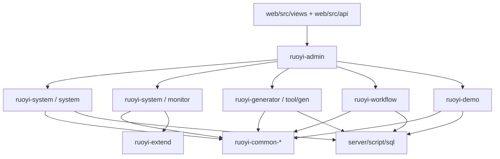

# 功能设计：后台功能域图谱

## 目标

本文档把 HarnessBase 当前后台功能域收敛到真实代码入口，避免继续沿用旧 ProjectPilot、CallCenter 或不存在的前端 monorepo 设想。

本文档只做功能域级设计导航；具体接口事实以 [docs/reference/api-spec.yaml](../reference/api-spec.yaml) 和运行时 SpringDoc 为准。

## 事实来源

| 事实类型 | 入口 |
| --- | --- |
| 后端启动与装配 | [server/ruoyi-admin](../../server/ruoyi-admin) |
| 系统管理与监控 Controller | [server/ruoyi-modules/ruoyi-system/src/main/java/org/dromara/system/controller](../../server/ruoyi-modules/ruoyi-system/src/main/java/org/dromara/system/controller) |
| 代码生成 Controller | [server/ruoyi-modules/ruoyi-generator/src/main/java/org/dromara/generator/controller/GenController.java](../../server/ruoyi-modules/ruoyi-generator/src/main/java/org/dromara/generator/controller/GenController.java) |
| 工作流 Controller | [server/ruoyi-modules/ruoyi-workflow/src/main/java/org/dromara/workflow/controller](../../server/ruoyi-modules/ruoyi-workflow/src/main/java/org/dromara/workflow/controller) |
| 示例 Controller | [server/ruoyi-modules/ruoyi-demo/src/main/java/org/dromara/demo/controller](../../server/ruoyi-modules/ruoyi-demo/src/main/java/org/dromara/demo/controller) |
| 前端 API | [web/src/api](../../web/src/api) |
| 前端页面 | [web/src/views](../../web/src/views) |
| 菜单和权限脚本 | [server/script/sql/ry_vue_5.X.sql](../../server/script/sql/ry_vue_5.X.sql)、[server/script/sql/ry_workflow.sql](../../server/script/sql/ry_workflow.sql) |

## 功能域总览

## 功能域矩阵

| 功能域 | 后端入口 | 前端入口 | 菜单与权限 | 当前职责 |
| --- | --- | --- | --- | --- |
| 系统管理 | [controller/system](../../server/ruoyi-modules/ruoyi-system/src/main/java/org/dromara/system/controller/system) | [web/src/views/system](../../web/src/views/system)、[web/src/api/system](../../web/src/api/system) | `system:*`；OSS 请求路径使用 `/resource/oss/*`，权限仍是 `system:oss*` | 用户、角色、部门、岗位、菜单、字典、参数、通知、客户端、租户、租户套餐、OSS |
| 系统监控 | [controller/monitor](../../server/ruoyi-modules/ruoyi-system/src/main/java/org/dromara/system/controller/monitor) | [web/src/views/monitor](../../web/src/views/monitor)、[web/src/api/monitor](../../web/src/api/monitor) | `monitor:*` | 在线用户、登录日志、操作日志、缓存监控、Spring Boot Admin、SnailJob 控制台入口 |
| 代码生成 | [GenController.java](../../server/ruoyi-modules/ruoyi-generator/src/main/java/org/dromara/generator/controller/GenController.java) | [web/src/views/tool/gen](../../web/src/views/tool/gen)、[web/src/api/tool/gen](../../web/src/api/tool/gen) | `tool:gen:*` | 数据表导入、生成配置、预览、下载、同步表结构、批量生成 |
| 工作流 | [workflow/controller](../../server/ruoyi-modules/ruoyi-workflow/src/main/java/org/dromara/workflow/controller) | [web/src/views/workflow](../../web/src/views/workflow)、[web/src/api/workflow](../../web/src/api/workflow) | `workflow:*` | 流程分类、流程定义、流程实例、待办已办、抄送、SpEL 表达式、请假示例 |
| 示例能力 | [demo/controller](../../server/ruoyi-modules/ruoyi-demo/src/main/java/org/dromara/demo/controller) | [web/src/views/demo](../../web/src/views/demo)、[web/src/api/demo](../../web/src/api/demo) | `demo:*` | 单表示例、树表示例，以及缓存、锁、限流、加密、Excel、WebSocket、SSE、短信、邮件、队列等能力示例 |

## 系统管理

系统管理是当前后台主业务域，真实 Controller 以 `/system/*` 和 `/resource/oss/*` 为主。

已核对的代表入口：

- 用户管理：[SysUserController.java](../../server/ruoyi-modules/ruoyi-system/src/main/java/org/dromara/system/controller/system/SysUserController.java) 使用 `/system/user`，列表权限为 `system:user:list`。
- 菜单管理：[SysMenuController.java](../../server/ruoyi-modules/ruoyi-system/src/main/java/org/dromara/system/controller/system/SysMenuController.java) 提供 `/system/menu/getRouters`、菜单树、角色菜单树、租户套餐菜单树等入口。
- 租户能力：[SysTenantController.java](../../server/ruoyi-modules/ruoyi-system/src/main/java/org/dromara/system/controller/system/SysTenantController.java)、[SysTenantPackageController.java](../../server/ruoyi-modules/ruoyi-system/src/main/java/org/dromara/system/controller/system/SysTenantPackageController.java) 对应 `system:tenant:*` 与 `system:tenantPackage:*`。
- OSS 能力：[SysOssController.java](../../server/ruoyi-modules/ruoyi-system/src/main/java/org/dromara/system/controller/system/SysOssController.java)、[SysOssConfigController.java](../../server/ruoyi-modules/ruoyi-system/src/main/java/org/dromara/system/controller/system/SysOssConfigController.java) 对应文件管理与对象存储配置。

维护约束：

- 新增系统管理页面时，必须同步后端 Controller、前端 [web/src/api/system](../../web/src/api/system)、前端 [web/src/views/system](../../web/src/views/system)、`sys_menu` 菜单和权限。
- 涉及用户、角色、菜单、租户或客户端授权时，必须联读 [docs/design/feature-auth.md](feature-auth.md)。
- 涉及字典、参数、通知、OSS 时，应同步检查缓存、i18n、上传配置和发布环境变量。

## 系统监控

系统监控包含两类能力：

- 后端直接提供的监控 API：在线用户、登录日志、操作日志、缓存监控。
- iframe 入口：Spring Boot Admin 和 SnailJob 控制台。

当前事实：

- 在线用户：[SysUserOnlineController.java](../../server/ruoyi-modules/ruoyi-system/src/main/java/org/dromara/system/controller/monitor/SysUserOnlineController.java) 使用 `/monitor/online`。
- 登录日志：[SysLogininforController.java](../../server/ruoyi-modules/ruoyi-system/src/main/java/org/dromara/system/controller/monitor/SysLogininforController.java) 使用 `/monitor/logininfor`。
- 操作日志：[SysOperlogController.java](../../server/ruoyi-modules/ruoyi-system/src/main/java/org/dromara/system/controller/monitor/SysOperlogController.java) 使用 `/monitor/operlog`。
- 缓存监控：[CacheController.java](../../server/ruoyi-modules/ruoyi-system/src/main/java/org/dromara/system/controller/monitor/CacheController.java) 当前只暴露 `/monitor/cache`。
- Admin 监控页面读取 `VITE_APP_MONITOR_ADMIN`，SnailJob 页面读取 `VITE_APP_SNAILJOB_ADMIN`。

已知差异：

- [web/src/api/monitor/cache/index.ts](../../web/src/api/monitor/cache/index.ts) 仍保留 `/monitor/cache/getNames`、`/getKeys`、`/getValue`、`/clearCacheName`、`/clearCacheKey`、`/clearCacheAll` 等请求封装；当前后端 `CacheController` 没有对应接口。只改文档时不要把这些路径写入 API 摘要，代码任务需要决定删除前端残留或补齐后端能力。

维护约束：

- 修改监控菜单时，同步检查 [server/script/sql/ry_vue_5.X.sql](../../server/script/sql/ry_vue_5.X.sql) 中 `monitor:*` 菜单权限。
- 修改 iframe 监控入口时，同步检查前端环境变量、发布环境变量模板和 Nginx/网关路径。
- 修改缓存监控时，必须同步 [docs/reference/README.md](../reference/README.md) 的已知差异和 [docs/reference/api-spec.yaml](../reference/api-spec.yaml)。

## 代码生成

代码生成域以 [GenController.java](../../server/ruoyi-modules/ruoyi-generator/src/main/java/org/dromara/generator/controller/GenController.java) 为唯一后端 Controller 入口，基础路径为 `/tool/gen`。

当前能力：

- 生成表列表：`/tool/gen/list`。
- 数据库表列表：`/tool/gen/db/list`。
- 表详情与字段：`/{tableId}`、`/column/{tableId}`。
- 导入表：`/importTable`。
- 生成配置更新：`PUT /tool/gen`。
- 预览、下载、生成到本地、同步表结构和批量生成。

维护约束：

- 代码生成依赖数据库元数据和生成配置，变更时必须同步 SQL 脚本、前端表单和模板行为。
- 新增生成模板或生成策略时，应优先落在 `ruoyi-generator`，不要把生成逻辑散落到业务模块。
- 生成结果如果会新增菜单、权限、SQL 或前端页面，必须同步 [docs/reference/sql-change-checklist.md](../reference/sql-change-checklist.md)。

## 工作流

工作流域以 `ruoyi-workflow` 为边界，核心路径是 `/workflow/*`。

当前能力：

- 流程分类：[FlwCategoryController.java](../../server/ruoyi-modules/ruoyi-workflow/src/main/java/org/dromara/workflow/controller/FlwCategoryController.java)。
- 流程定义：[FlwDefinitionController.java](../../server/ruoyi-modules/ruoyi-workflow/src/main/java/org/dromara/workflow/controller/FlwDefinitionController.java)。
- 流程实例：[FlwInstanceController.java](../../server/ruoyi-modules/ruoyi-workflow/src/main/java/org/dromara/workflow/controller/FlwInstanceController.java)。
- 流程任务：[FlwTaskController.java](../../server/ruoyi-modules/ruoyi-workflow/src/main/java/org/dromara/workflow/controller/FlwTaskController.java)。
- SpEL 表达式：[FlwSpelController.java](../../server/ruoyi-modules/ruoyi-workflow/src/main/java/org/dromara/workflow/controller/FlwSpelController.java)。
- 请假示例：[TestLeaveController.java](../../server/ruoyi-modules/ruoyi-workflow/src/main/java/org/dromara/workflow/controller/TestLeaveController.java)。

工作流前端通过 [web/src/api/workflow/workflowCommon](../../web/src/api/workflow/workflowCommon) 在待办、已办、抄送和流程实例页面之间跳转，主要依赖 `businessId`、`taskId` 和表单路径。

已知差异：

- [web/src/api/workflow/definition/index.ts](../../web/src/api/workflow/definition/index.ts) 仍保留 `/workflow/definition/definitionXml/{definitionId}`；当前后端真实可用入口是 `/workflow/definition/xmlString/{id}`。

维护约束：

- 修改流程定义、任务、实例或表单跳转时，必须同步核对前端 workflow API、页面、`workflowCommon` 跳转参数和 [server/script/sql/ry_workflow.sql](../../server/script/sql/ry_workflow.sql)。
- 工作流菜单和权限不只在主初始化脚本中，还依赖 `ry_workflow.sql`，发布前必须纳入 SQL 检查。
- 新增业务流程示例时，应明确它是 demo 示例还是正式业务功能，避免把示例流程误写成核心业务事实。

## 示例能力

示例域用于展示框架能力，不等同于正式业务域。

当前页面化能力：

- 单表示例：[web/src/views/demo/demo](../../web/src/views/demo/demo)、[TestDemoController.java](../../server/ruoyi-modules/ruoyi-demo/src/main/java/org/dromara/demo/controller/TestDemoController.java)。
- 树表示例：[web/src/views/demo/tree](../../web/src/views/demo/tree)、[TestTreeController.java](../../server/ruoyi-modules/ruoyi-demo/src/main/java/org/dromara/demo/controller/TestTreeController.java)。

当前 API 示例还覆盖缓存、锁、限流、加密、Excel、i18n、敏感词、WebSocket、短信、邮件、队列等能力，但这些并不都对应完整后台菜单页面。

维护约束：

- 示例能力可以作为 common 能力使用方式参考，但不能直接复制成正式业务设计。
- 如果把示例能力提升为正式功能，必须重新定义模块边界、权限、菜单、SQL、测试和发布影响。
- 示例接口不应替代正式的安全、审计、限流或异常处理设计。

## 菜单和权限维护

当前后台菜单和按钮权限主要由 SQL 脚本初始化：

- [server/script/sql/ry_vue_5.X.sql](../../server/script/sql/ry_vue_5.X.sql) 定义系统管理、租户管理、系统监控、系统工具和测试菜单。
- [server/script/sql/ry_workflow.sql](../../server/script/sql/ry_workflow.sql) 定义工作流菜单和 `workflow:*` 权限。

新增或修改功能时，必须同步确认：

- 菜单目录、页面组件路径和隐藏页面路径。
- `@SaCheckPermission` 与 `sys_menu.perms` 是否一致。
- 前端按钮权限和后端接口权限是否匹配。
- 初始化脚本和 `update/` 升级脚本是否都需要更新。

## 非目标

本文档不描述：

- ProjectPilot 项目管理、搜索或计费模型。
- CallCenter 业务流程或交付结构。
- 不存在的 `web/apps/projectpilot-web`、`server/bootstrap`、`server/shared` 目标目录。
- Flyway migration 引入方案。

## 推荐联读

- [docs/architecture/code-map.md](../architecture/code-map.md)
- [docs/architecture/boundaries.md](../architecture/boundaries.md)
- [docs/design/backend-admin-roadmap.md](backend-admin-roadmap.md)
- [docs/reference/api-spec.yaml](../reference/api-spec.yaml)
- [docs/reference/README.md](../reference/README.md)
- [docs/reference/sql-change-checklist.md](../reference/sql-change-checklist.md)
