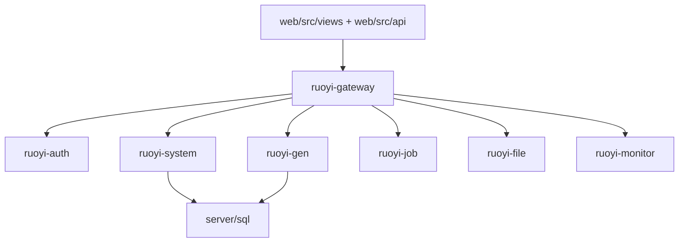

# 功能设计：后台功能域图谱

## 目标

本文档把 HarnessBase 当前后台功能域收敛到真实代码入口，避免继续沿用旧单体、旧业务或不存在的目录设想。

## 事实来源

| 事实类型 | 入口 |
| --- | --- |
| 网关入口 | [server/ruoyi-gateway](../../server/ruoyi-gateway) |
| 认证服务 | [server/ruoyi-auth](../../server/ruoyi-auth) |
| 系统管理 Controller | [server/ruoyi-modules/ruoyi-system/src/main/java/com/ruoyi/system/controller](../../server/ruoyi-modules/ruoyi-system/src/main/java/com/ruoyi/system/controller) |
| 代码生成 Controller | [server/ruoyi-modules/ruoyi-gen](../../server/ruoyi-modules/ruoyi-gen) |
| 文件服务 | [server/ruoyi-modules/ruoyi-file](../../server/ruoyi-modules/ruoyi-file) |
| 前端 API | [web/src/api](../../web/src/api) |
| 前端页面 | [web/src/views](../../web/src/views) |
| SQL 脚本 | [server/sql](../../server/sql) |

## 功能域总览

## 功能域矩阵

| 功能域 | 后端入口 | 前端入口 | 当前职责 |
| --- | --- | --- | --- |
| 系统管理 | [ruoyi-system controller](../../server/ruoyi-modules/ruoyi-system/src/main/java/com/ruoyi/system/controller) | [web/src/views/system](../../web/src/views/system)、[web/src/api/system](../../web/src/api/system) | 用户、角色、部门、菜单、字典、参数、通知、日志等 |
| 系统监控 | [ruoyi-system controller](../../server/ruoyi-modules/ruoyi-system/src/main/java/com/ruoyi/system/controller) 与 [ruoyi-monitor](../../server/ruoyi-visual/ruoyi-monitor) | [web/src/views/monitor](../../web/src/views/monitor)、[web/src/api/monitor](../../web/src/api/monitor) | 在线用户、登录日志、操作日志、缓存、监控入口 |
| 工具 | [ruoyi-gen](../../server/ruoyi-modules/ruoyi-gen) | [web/src/views/tool](../../web/src/views/tool)、[web/src/api/tool](../../web/src/api/tool) | 代码生成、表单构建 |
| 文件服务 | [ruoyi-file](../../server/ruoyi-modules/ruoyi-file) | 通过业务页面或系统配置接入 | 上传、下载、存储服务 |

## 维护约束

- 新增系统管理页面时，必须同步后端 Controller、前端 API、前端页面和权限配置。
- 修改监控入口时，必须同步检查前端页面、后端接口和发布环境访问路径。
- 修改工具功能时，必须同步核对生成器服务与前端工具页面。
- 功能域文档只描述当前真实模块，不再假设不存在的 `workflow`、`demo` 或 `ruoyi-admin` 目录。
