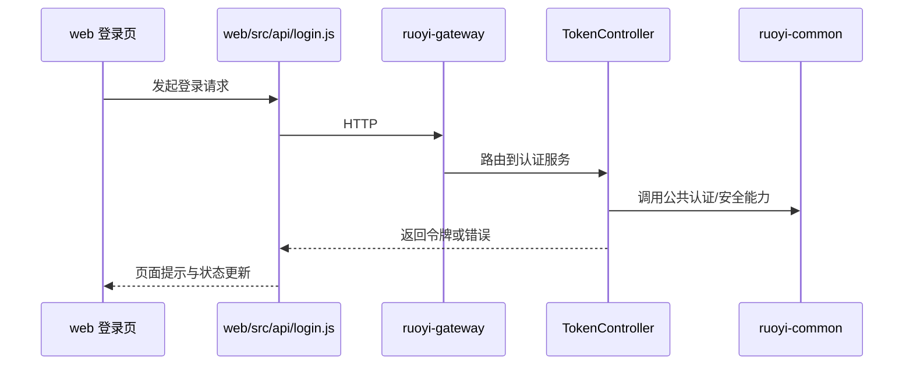

# 功能设计：认证、会话、租户与权限

## 背景

当前认证能力来自若依微服务体系，真实入口位于：

- [server/ruoyi-auth/src/main/java/com/ruoyi/auth/controller/TokenController.java](../../server/ruoyi-auth/src/main/java/com/ruoyi/auth/controller/TokenController.java)
- [server/ruoyi-gateway](../../server/ruoyi-gateway)
- [server/ruoyi-common](../../server/ruoyi-common)
- [web/src/api/login.js](../../web/src/api/login.js)

本文档只描述当前系统事实与后续收敛方向，不再沿用旧单体认证路径。

## 当前能力

- 支持登录、登出
- 支持网关层验证码与请求校验
- 支持基于认证中心的令牌获取
- 支持租户、权限和用户信息链路

## 关键链路

## 后端边界

- 网关负责统一入口校验和路由。
- `ruoyi-auth` 负责认证接口与令牌链路。
- 公共鉴权、安全与工具能力通过 `ruoyi-common-*` 接入。
- 用户、角色、菜单等权限数据由 `ruoyi-system` 承载。

## 前端边界

- 登录相关请求放在 [web/src/api/login.js](../../web/src/api/login.js)。
- 用户、权限和路由状态需同步检查 [web/src/store](../../web/src/store) 和 [web/src/router](../../web/src/router)。

## 设计约束

- 新增认证方式前，先确认是否能扩展现有认证服务。
- 新增权限规则前，必须同步系统服务、前端按钮控制和菜单配置。
- 禁止绕过网关和认证服务自行复制登录逻辑。

## 推荐联读

- [docs/architecture/data-flow.md](../architecture/data-flow.md)
- [docs/reference/api-spec.yaml](../reference/api-spec.yaml)
- [docs/reference/error-codes.md](../reference/error-codes.md)
- [docs/reviews/backend-design-review-checklist.md](../reviews/backend-design-review-checklist.md)
