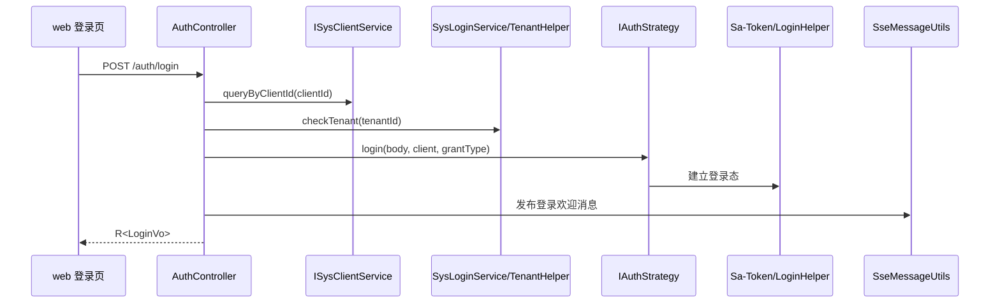

# 功能设计：认证、会话、租户与权限

## 背景

当前认证能力来自 RuoYi-Vue-Plus 体系，真实入口位于：

- [server/ruoyi-admin/src/main/java/org/dromara/web/controller/AuthController.java](../../server/ruoyi-admin/src/main/java/org/dromara/web/controller/AuthController.java)
- [server/ruoyi-admin/src/main/java/org/dromara/web/controller/CaptchaController.java](../../server/ruoyi-admin/src/main/java/org/dromara/web/controller/CaptchaController.java)
- [server/ruoyi-admin/src/main/java/org/dromara/web/service](../../server/ruoyi-admin/src/main/java/org/dromara/web/service)
- [server/ruoyi-common/ruoyi-common-satoken](../../server/ruoyi-common/ruoyi-common-satoken)
- [server/ruoyi-common/ruoyi-common-tenant](../../server/ruoyi-common/ruoyi-common-tenant)
- [web/src/api/login.ts](../../web/src/api/login.ts)

本文档只描述当前系统事实与后续收敛方向，不再沿用旧项目管理产品中的业务对象权限模型。

## 当前能力

- 支持登录、登出、受配置开关控制的注册。
- 支持验证码、短信验证码、邮箱验证码。
- 支持基于 `clientId` 与 `grantType` 的客户端授权类型控制。
- 支持密码、短信、邮箱、社交、小程序等认证策略扩展。
- 登录链路支持租户列表、租户启停和租户过期校验；租户与租户套餐管理归属系统管理域。
- 支持 Sa-Token 登录态、角色与权限注解。
- 支持 SSE 登录后消息推送。

## 关键链路

## 后端边界

- Controller 负责协议入口、参数接收和响应返回。
- `SysLoginService`、`SysRegisterService` 负责登录、登出、注册和租户校验。
- `IAuthStrategy` 负责按授权类型分发认证策略。
- Sa-Token 能力必须通过 `ruoyi-common-satoken` 与相关工具类接入。
- 租户能力必须通过 `ruoyi-common-tenant` 与 `ruoyi-system` 服务接入。

## 前端边界

- 登录相关请求放在 [web/src/api/login.ts](../../web/src/api/login.ts)。
- 登录状态、用户信息、权限路由需要同步检查 [web/src/store/modules/user.ts](../../web/src/store/modules/user.ts)、[web/src/store/modules/permission.ts](../../web/src/store/modules/permission.ts) 和 [web/src/router](../../web/src/router)。
- 前端默认从 `VITE_APP_CLIENT_ID` 读取 `clientId`，未显式传入 `grantType` 时按 `password` 登录。
- 前端开启 `VITE_APP_SSE` 时，登出前会调用 `/resource/sse/close` 关闭 SSE 连接。

## 设计约束

- 新增认证方式前，先检查是否能扩展现有 `IAuthStrategy`。
- 新增客户端授权类型前，必须同步客户端配置、权限说明、前端请求参数和测试。
- 新增租户规则前，必须同步 SQL、接口、前端页面和错误消息。
- 禁止绕过 Sa-Token 自建并行登录态。
- 禁止把第三方登录 SDK 直接扩散到业务 Controller。

## 错误与消息

当前系统大量使用 `R(code,msg,data)` 与 i18n 消息键：

- 响应结构见 [docs/reference/error-codes.md](../reference/error-codes.md)。
- i18n 消息位于 [server/ruoyi-admin/src/main/resources/i18n](../../server/ruoyi-admin/src/main/resources/i18n)。

修改认证错误提示时，应同步检查 i18n 文件、前端提示和测试。

## 测试要求

- 登录成功、客户端授权类型错误、租户不可用、验证码错误、登出、注册关闭等路径应有回归覆盖。
- 新增认证策略必须覆盖成功、失败、锁定或限流场景。
- 涉及租户隔离时，必须覆盖跨租户访问风险。

## 推荐联读

- [docs/architecture/data-flow.md](../architecture/data-flow.md)
- [docs/reference/api-spec.yaml](../reference/api-spec.yaml)
- [docs/reference/error-codes.md](../reference/error-codes.md)
- [docs/reviews/backend-design-review-checklist.md](../reviews/backend-design-review-checklist.md)
